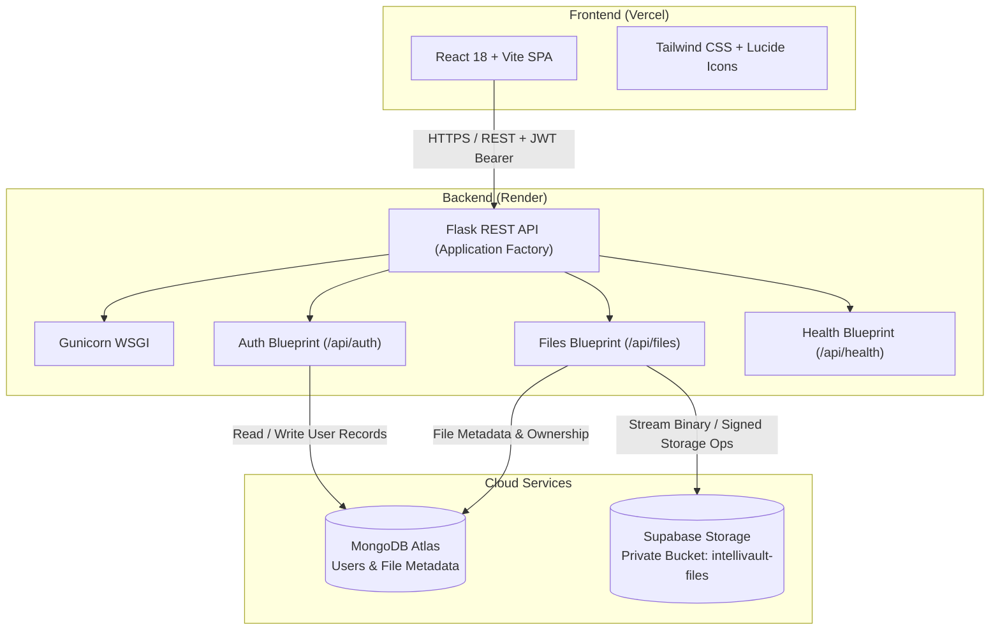

# IntelliVault

> **Secure Cloud Storage with AI-Powered Document Intelligence**

[](#testing--quality-assurance)
[](#technology-stack)
[](#technology-stack)
[](#technology-stack)
[](#technology-stack)
[](#production-deployment)

---

## Overview

**IntelliVault** is a secure, full-stack cloud storage web application designed to give users granular control over their digital documents. Built with a decoupled **React + Vite** single-page application and a **Python Flask** REST API, IntelliVault manages file persistence across **Supabase Storage** (for binary objects) and **MongoDB Atlas** (for file metadata and user identity).

The platform enforces strict security boundaries: authentication relies on stateless JSON Web Tokens (JWT) with bcrypt password hashing, file downloads and previews require authenticated backend token verification, and cloud storage credentials remain completely hidden on the server side.

---

## System Architecture



### Architectural Principles

1. **Zero Credential Leakage:** The client never talks directly to Supabase Storage or MongoDB. The `SUPABASE_SERVICE_KEY` and database connection strings reside solely in backend environment variables.
2. **Backend Ownership Enforcement:** Every file download, preview, and deletion operation verifies that the authenticated JWT user ID matches the file document's `user_id` in MongoDB.
3. **Decoupled Binary and Metadata Storage:** Binary blobs are safely offloaded to cloud object storage (Supabase Storage), while metadata (original filename, MIME type, size, upload timestamp, ownership) is indexed in MongoDB for efficient querying.

---

## Currently Implemented Features

### 1. User Registration & Onboarding
- **Email & Password Registration:** Validates user credentials with strict checks on email format and password strength.
- **Secure Password Hashing:** Uses `bcrypt` with automated salt generation. Plaintext passwords are never logged or stored.
- **Duplicate Protection:** Guarantees unique email constraints in MongoDB with descriptive client error messaging.

### 2. Authentication & Session Management
- **JWT-Based Authentication:** Issues signed HS256 JSON Web Tokens upon successful login containing user identity and role claims.
- **Protected Endpoints:** Custom `@jwt_required` decorator validates token expiration and signature across all private routes.
- **Automatic Session Restoration:** Automatically validates cached tokens and hydrates user state upon page reload (`/api/auth/me`).
- **Session Expiration Handling:** Seamlessly intercepts 401 Unauthorized responses to clear stale credentials and route back to the authentication screen.

### 3. Cloud File Storage & Persistence
- **Cloud Object Storage:** Fully integrated with Supabase Storage using a dedicated, private bucket (`intellivault-files`).
- **Metadata Persistence:** Stores document ownership, unique storage keys, content types, byte sizes, and timestamps in MongoDB.
- **User-Specific Isolation:** Storage paths are partitioned by user ID (`user-files/<user_id>/<unique_id>_<filename>`), preventing filename collisions and unauthorized cross-tenant access.

### 4. File Management & Multi-File Upload
- **Native Multi-File Selection:** HTML file picker equipped with `multiple`, supporting standard OS multi-selection (`Ctrl+Click`, `Shift+Click`).
- **Pre-Upload Staging Preview:** Selected files are displayed in an itemized preview list showing filename, formatted byte size, and an individual remove (`X`) button prior to upload.
- **Sequential Dispatch:** Files are uploaded sequentially to preserve isolated transaction boundaries in MongoDB and Supabase Storage without requiring heavy queue infrastructure.
- **Progress Tracking:** Live upload indicator displays current progress (e.g., `Uploading (2/5)...`).
- **Partial Failure Resiliency:** Successes and failures are tracked independently. Successfully uploaded files are cleared from staging, while failed files remain selected for convenient retry.
- **File Actions:** Instant file listing refresh, authenticated file downloads with correct headers, and permanent file deletion (removes object from Supabase and metadata from MongoDB).

### 5. In-App File Preview
- **In-App Modal Viewer:** Preview files directly in the dashboard without forcing external downloads.
- **PDF Viewer:** Seamlessly renders PDF documents via authenticated blob retrieval in an embedded iframe.
- **Image Viewer:** Displays image formats (`PNG`, `JPG`, `JPEG`, `GIF`, `WEBP`, `SVG`, `BMP`, `ICO`) in a responsive container with aspect-ratio preservation.
- **Code & Text Viewer:** Formatted text preview for plain text and developer files (`TXT`, `LOG`, `CSV`, `JSON`, `MD`, `PY`, `JS`, `TS`, `HTML`, `CSS`, `XML`, `YAML`).
- **Unsupported Type Fallback:** Displays a clean notification explaining that an in-browser preview is unavailable and provides a direct download button.

### 6. Security & Validation
- **50 MB File Size Enforcement:** Enforced both on the frontend (instant pre-upload validation badge) and on the backend (authoritative 400 rejection).
- **Backend Ownership Verification:** Confirms document ownership in MongoDB before executing any file download, preview, or delete operation.
- **Private Storage Credentials:** Keeps Supabase service credentials and MongoDB URIs strictly on the backend, preventing client exposure.
- **CORS Configuration:** Enabled via `flask-cors` on `/api/*` routes to permit cross-origin communication between the frontend and backend services.

### 7. Testing & Quality Assurance
- **Comprehensive Pytest Suite:** 104 automated backend test cases covering authentication, file operations, model validation, security edge cases, and error responses.
- **Production Build Testing:** Zero-error production bundle compilation verified with Vite.
- **End-to-End Integration Verification:** End-to-end multi-file upload, listing, download, preview blob streaming, and cleanup verified against live services.

---

## Technology Stack

| Layer | Technologies | Purpose |
| :--- | :--- | :--- |
| **Frontend** | React 18, Vite 6, Tailwind CSS 3 | Fast, responsive single-page user interface |
| **Icons & UI** | Lucide React | Modern vector iconography |
| **HTTP Client** | Axios | Configured API client with interceptors for JWT injection |
| **Backend Framework** | Python 3, Flask 3 | REST API built with application factory and Blueprints |
| **WSGI Server** | Gunicorn | Production-ready WSGI HTTP server for Render |
| **Database** | MongoDB Atlas / PyMongo | Document-based metadata storage, users, and audit logs |
| **Object Storage** | Supabase Storage (`supabase-py`) | Scalable cloud storage for private binary files |
| **Authentication** | PyJWT, bcrypt | Stateless JWT authorization and salted password hashing |
| **Automated Testing** | pytest, mongomock | Backend unit, model, route, and mock database testing |
| **Hosting & Deploy** | Vercel (Frontend), Render (Backend) | Continuous deployment from GitHub `main` branch |

---

## Project Structure

```text
IntelliVault/
├── backend/
│   ├── app/
│   │   ├── __init__.py           # Flask application factory (create_app)
│   │   ├── config.py             # Environment configurations (Development, Production, Testing)
│   │   ├── models/
│   │   │   ├── user.py           # User entity and MongoDB schema serialization
│   │   │   └── file.py           # FileMetadata entity (50 MB validation, schema checks)
│   │   ├── routes/
│   │   │   ├── auth.py           # Registration, login, and current-user endpoints
│   │   │   ├── files.py          # Upload, list, download, and delete endpoints
│   │   │   └── health.py         # Liveness and system readiness probes
│   │   ├── services/
│   │   │   ├── auth_service.py   # User registration, bcrypt verification, JWT generation
│   │   │   ├── file_service.py   # File validation, Supabase upload/download/delete, Mongo CRUD
│   │   │   ├── db.py             # PyMongo database connection client and health checks
│   │   │   └── storage.py        # Supabase Storage client adapter
│   │   └── utils/
│   │       ├── security.py       # Password hashing, JWT encode/decode, @jwt_required decorator
│   │       ├── response.py       # Standardized API response formatters (success/error)
│   │       └── logger.py         # Structured logging utility
│   ├── tests/                    # 104 automated tests covering routes, models, auth, and files
│   ├── requirements.txt          # Python dependencies (Flask, Supabase, PyMongo, Gunicorn, etc.)
│   └── run.py                    # Local development server entrypoint
│
├── frontend/
│   ├── src/
│   │   ├── components/
│   │   │   ├── Auth.jsx          # Login and registration interface with tab toggle
│   │   │   └── Dashboard.jsx     # File management, multi-file upload, preview modal, stats
│   │   ├── services/
│   │   │   └── api.js            # Axios client, auth helpers, file API calls, preview blob fetcher
│   │   ├── App.jsx               # Main state router (auth state, session restoration)
│   │   ├── main.jsx              # React DOM root entrypoint
│   │   └── index.css             # Tailwind CSS directives
│   ├── package.json              # Frontend scripts and npm dependencies
│   ├── vite.config.js            # Vite build and development proxy configuration
│   └── tailwind.config.js        # Tailwind styling configuration
│
├── .env.example                  # Environment variable reference template
└── README.md                     # Project documentation
```

---

## API Endpoints

All endpoints except `/api/health` and `/api/auth/{login,register}` require the `Authorization: Bearer <token>` header.

| Method | Endpoint | Auth Required | Description |
| :--- | :--- | :---: | :--- |
| `GET` | `/api/health` | No | Basic API liveness health check |
| `GET` | `/api/system/status` | No | System readiness check (MongoDB & Supabase connectivity) |
| `POST` | `/api/auth/register` | No | Create a new user account |
| `POST` | `/api/auth/login` | No | Authenticate user and receive JWT access token |
| `GET` | `/api/auth/me` | Yes | Retrieve profile details of currently logged-in user |
| `POST` | `/api/files/upload` | Yes | Upload a single file (`multipart/form-data`) |
| `GET` | `/api/files` | Yes | List all files belonging to the authenticated user |
| `GET` | `/api/files/<file_id>/download` | Yes | Stream/download an authenticated binary file |
| `DELETE` | `/api/files/<file_id>` | Yes | Delete a file from Supabase Storage and MongoDB |

---

## Local Development Setup

### Prerequisites
- **Python 3.10+**
- **Node.js 18+** and **npm**
- **MongoDB Atlas** database connection URI (or local MongoDB)
- **Supabase** project with a private storage bucket named `intellivault-files`

---

### 1. Clone the Repository
```bash
git clone https://github.com/vaibhavv1821/IntelliVault-Secure-Cloud-Storage-with-AI-Powered-Document-Intelligence.git
cd IntelliVault
```

---

### 2. Configure Environment Variables
Copy the template to create your local `.env`:
```bash
cp .env.example .env
```

Populate the required configuration variables:
```ini
# Flask Configuration
FLASK_APP=backend/run.py
FLASK_DEBUG=True
PORT=5000
SECRET_KEY=your-secure-flask-secret-key

# MongoDB Database Configuration
MONGODB_URI=mongodb+srv://<username>:<password>@cluster0.mongodb.net/intellivault?retryWrites=true&w=majority
MONGODB_DB_NAME=intellivault

# Supabase Storage Configuration (Backend Only)
SUPABASE_URL=https://<your-project-ref>.supabase.co
SUPABASE_SERVICE_KEY=your-supabase-service-role-key
SUPABASE_BUCKET_NAME=intellivault-files

# JWT Authentication
JWT_SECRET_KEY=your-secure-jwt-signing-secret
JWT_ACCESS_TOKEN_EXPIRES_HOURS=24

# Frontend API URL
VITE_API_BASE_URL=http://127.0.0.1:5000/api
```

---

### 3. Backend Setup
```bash
# Optional: Create and activate a virtual environment
python -m venv venv
# Windows:
venv\Scripts\activate
# macOS/Linux:
source venv/bin/activate

# Install dependencies
pip install -r backend/requirements.txt

# Run the test suite to verify setup
python -m pytest backend/tests/ -v

# Start the Flask development server
python backend/run.py
```
The backend will run on `http://127.0.0.1:5000`.

---

### 4. Frontend Setup
In a separate terminal window:
```bash
cd frontend

# Install npm dependencies
npm install

# Start the Vite development server
npm run dev
```
The frontend will start on `http://localhost:5173`.

---

## Testing & Quality Assurance

The backend includes a comprehensive automated test suite powered by `pytest` and `mongomock`:

```bash
python -m pytest backend/tests/ -v
```

**Test Coverage Highlights:**
- **`test_auth_register.py` & `test_auth_login.py`**: Validates registration flow, duplicate email rejection, bcrypt hash verification, JWT issuance, and login telemetry.
- **`test_files.py`**: Validates single/multiple upload flows, metadata storage, ownership isolation between users, and deletion.
- **`test_file_model.py`**: Verifies 50 MB boundary validation, filename sanitization, and MongoDB dictionary serialization.
- **`test_health.py`**: Verifies liveness probes and database/storage readiness checks.

To verify the frontend production build:
```bash
npm run build --prefix frontend
```

---

## Production Deployment

IntelliVault is deployed across cloud platforms:

- **Frontend:** Deployed on **Vercel**
  - Framework: Vite
  - Build Command: `npm run build`
  - Output Directory: `dist`
  - Environment Variable: `VITE_API_BASE_URL=https://intellivault-backend.onrender.com/api`
- **Backend:** Deployed as a Web Service on **Render**
  - Build Command: `pip install -r backend/requirements.txt`
  - Start Command: `gunicorn --bind 0.0.0.0:$PORT "backend.app:create_app()"`
  - Environment Variables: All backend secrets (`MONGODB_URI`, `SUPABASE_URL`, `SUPABASE_SERVICE_KEY`, `JWT_SECRET_KEY`, etc.) configured securely via Render dashboard.
- **Database:** Hosted on **MongoDB Atlas**
- **Object Storage:** Hosted on **Supabase Storage** with private bucket policies

---

## Planned / Future Enhancements

> [!NOTE]
> While the project title includes **"AI-Powered Document Intelligence"**, the core AI pipelines and cryptographic envelope encryption are currently scheduled for future development phases. The functionality documented below represents the forward-looking roadmap and is **not yet implemented** in the active codebase.

1. **AI Document Intelligence & Classification:**
   - Automated document categorization (e.g., invoices, legal contracts, receipts, identity documents) using scikit-learn (`TF-IDF` + `LinearSVC`).
   - Computer vision document analysis and visual tagging using MobileNetV2.
2. **Optical Character Recognition (OCR) & Extraction:**
   - Text extraction from scanned PDFs and document images via Tesseract OCR and OpenCV preprocessing.
   - Named Entity Recognition (NER) with spaCy to detect and redact Personally Identifiable Information (PII) like SSNs, credit card numbers, and phone numbers.
3. **Semantic Search & Document Summarization:**
   - Vector embeddings generated from extracted document text.
   - Natural language search allowing users to search file contents semantically rather than by exact filename.
   - Extractive and abstractive document summaries.
4. **Zero-Knowledge Client-Side Encryption:**
   - Envelope encryption using AES-256-GCM directly in the browser before dispatching files to the backend.
   - Client-managed keys ensuring that neither the server nor cloud storage can inspect file contents without user authorization.
5. **Intelligent Storage Optimization & Anomaly Detection:**
   - Isolation Forest models analyzing user access logs to flag anomalous download behaviors or potential token theft.
   - Access-frequency heuristics to suggest archiving infrequently accessed files.

---

## Key Interview Discussion Points

When discussing IntelliVault in interviews or technical evaluations:

1. **Why Supabase Storage over local filesystem or self-hosted storage?**
   - Supabase Storage provides scalable, managed S3-compatible cloud storage with enterprise-grade durability and private access control, eliminating the maintenance burden of local disk management in serverless/containerized deployments like Render.
2. **Why sequential multi-file upload instead of a single bulk multipart request?**
   - Sequential upload ensures distinct transactional boundaries per file. If 1 file out of 5 fails validation (e.g., exceeds 50 MB), the remaining 4 files still upload successfully, and the user receives granular per-file feedback.
3. **How is security preserved without a public Supabase bucket?**
   - The Supabase bucket is private. The client never gets direct signed upload URLs or access keys. All downloads and previews pass through the Flask backend where JWT ownership validation is performed before streaming data back.
4. **How are file previews generated securely?**
   - The frontend requests the binary file via an authenticated Axios call using the user's JWT, converts the response to a temporary local browser object URL (`URL.createObjectURL`), and revokes the URL on modal closure to avoid memory leaks.

---

## License

This project is open source and available under the [MIT License](LICENSE).
