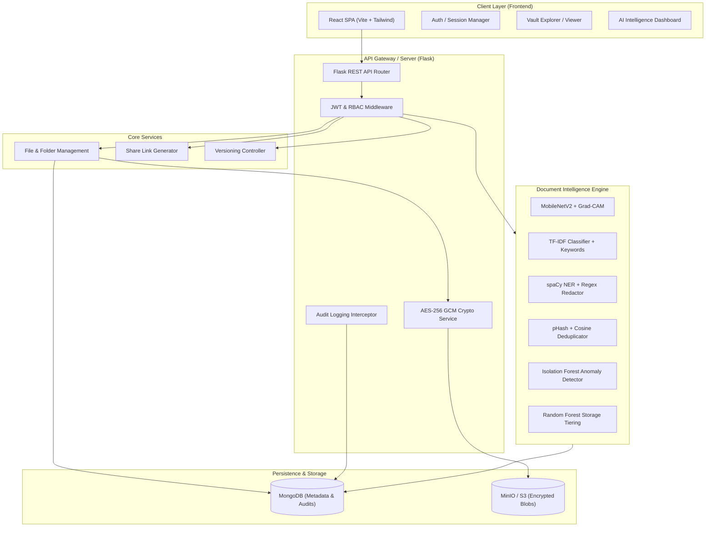
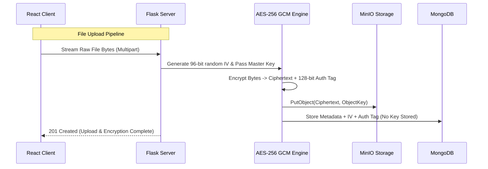
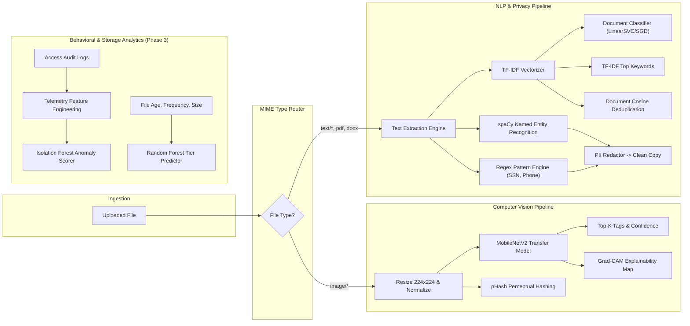

# IntelliVault ~ Master Technical Documentation
**Secure Cloud Storage with AI-Powered Document Intelligence**

---

## 1. Cover Page

* **Project Title:** IntelliVault: Secure Cloud Storage with AI-Powered Document Intelligence
* **System Type:** Cloud-native File Management, Cryptographic Vault & Document AI Platform
* **Architecture:** Decoupled Client-Server (React Frontend + Flask RESTful Backend + MongoDB Metadata Store + MinIO/S3 Object Store)
* **Author / Lead Engineer:** Engineering Pair (User & Antigravity)
* **Project Status:** Phase 0 ~ Foundation [COMPLETED & VERIFIED]
* **Version:** 0.1.0-foundation
* **Last Updated:** 2026-09-03
* **Repository:** `vaibhavv1821/IntelliVault-Secure-Cloud-Storage-with-AI-Powered-Document-Intelligence`

---

## 2. Project Overview

IntelliVault is an enterprise-grade cloud storage and document intelligence platform. It merges zero-knowledge cryptographic file security with on-premise, privacy-preserving machine learning and computer vision pipelines. Unlike consumer cloud storage services that treat files as opaque binary blobs, IntelliVault inspects, structures, tags, secures, and optimizes file lifecycle states dynamically without relying on third-party generative AI APIs.

The system empowers individuals and organizations to:
1. Securely store and version files protected by client-side or zero-trust server-side encryption (AES-256 GCM).
2. Automatically organize files using self-hosted computer vision (MobileNetV2) and NLP classifiers (TF-IDF + scikit-learn).
3. Safeguard privacy via real-time named entity recognition (spaCy) and pattern detection for automated PII redaction.
4. Detect duplicate data across visual perceptual hashes and document vector spaces.
5. Continuously audit and score operational risk using unsupervised anomaly detection (Isolation Forests) and storage tier recommendations (Random Forests).

---

## 3. Problem Statement

Modern cloud storage platforms present three critical operational trade-offs:
1. **Security vs. Intelligence Trade-off:** Most cloud storage providers either offer end-to-end encryption with no content searchability, or scan files by sending unencrypted user data to proprietary public AI services, exposing confidential intellectual property and personally identifiable information (PII).
2. **Data Hoarding and Storage Costs:** Unstructured storage accrues duplicate files, stale versions, and sensitive unredacted records without actionable visibility into storage consumption tiers.
3. **Absence of Self-Hosted Privacy Compliance:** Organizations subject to strict data governance frameworks (e.g., GDPR, HIPAA, CCPA) cannot send sensitive documentation to external LLM APIs for summarization, entity extraction, or content tagging.

IntelliVault solves these dilemmas by combining application-level envelope encryption with local, interpretable ML pipelines that run strictly inside the user's controlled infrastructure.

---

## 4. Motivation

1. **Demonstrate Full-Stack & Applied AI Engineering:** Build a robust, production-ready full-stack system with authentic machine learning, computer vision, and NLP components from first principles rather than black-box API integrations.
2. **Privacy-Preserving Computing:** Provide complete operational transparency where sensitive documents are indexed, tagged, and analyzed without leaving the trusted boundary.
3. **Interview-Grade Architecture:** Maintain a clean, modular, and defensible architectural design suitable for high-level software engineering and applied AI technical interviews.

---

## 5. Objectives

* **Core Storage & Security:** Build a reliable, multi-tenant file storage service supporting folders, hierarchy, versioning, expiring secure share links, role-based access control (RBAC), and AES-256 encryption.
* **Computer Vision Intelligence:** Implement lightweight transfer-learning image classification using MobileNetV2 with Grad-CAM visual heatmaps for explainable predictions.
* **Document NLP:** Implement text extraction, TF-IDF vectorization, multiclass document categorization, and automated keyword extraction.
* **Privacy & Compliance:** Detect structured and unstructured PII using regex patterns and spaCy Named Entity Recognition, automatically generating sanitized redaction previews.
* **Duplicate Detection:** Identify near-duplicate media via Perceptual Hashing (pHash) and documents via cosine similarity on TF-IDF matrices.
* **Security & Optimization Analytics:** Predict hot/cold lifecycle tiers using Random Forests and detect unauthorized or anomalous access patterns using Isolation Forests.

---

## 6. Scope

### In Scope
* Full local development environment with mockable/pluggable cloud-ready adapters (MongoDB, MinIO/S3).
* REST API endpoints for user authentication, file lifecycle, folder hierarchies, sharing, and ML inference.
* React single-page application with responsive Tailwind CSS interface.
* Offline/self-contained machine learning models without external commercial cloud AI APIs.
* Complete test suites (unit, integration, and ML validation).

### Out of Scope
* Commercial third-party generative AI endpoints (OpenAI, Anthropic, Google Gemini API for core features).
* Mobile apps (iOS/Android native).
* Multi-region distributed storage consensus (handled at the MinIO/Ceph/AWS storage infrastructure layer).

---

## 7. Key Features & Phase Status Matrix

| ID | Feature Module | Target Phase | Implementation Status | Verification Status |
| :--- | :--- | :--- | :--- | :--- |
| F01 | Project Skeleton & Logging | Phase 0 | **IMPLEMENTED** | **TESTED** (File & Console Loggers) |
| F02 | Flask Backend Factory & Routing | Phase 0 | **IMPLEMENTED** | **TESTED** (PyTest Suite 4/4 Passed) |
| F03 | React + Vite + Tailwind Frontend | Phase 0 | **IMPLEMENTED** | **TESTED** (Vite Build 0 Errors) |
| F04 | MongoDB Connection Adapter | Phase 0 | **IMPLEMENTED** | **TESTED** (Diagnostic Probe Verified) |
| F05 | MinIO/S3 Storage Adapter | Phase 0 | **IMPLEMENTED** | **TESTED** (Diagnostic Probe Verified) |
| F06 | User Registration & Auth Models | Phase 1 | **IMPLEMENTED** | **TESTED** (18 Integration Tests) |
| F06b| Login & JWT Token Generation | Phase 1 | **IMPLEMENTED** | **TESTED** (9 Integration Tests) |
| F06c| Auth Middleware & Protected Dashboard | Phase 1 | **IMPLEMENTED** | **TESTED** (9 Integration Tests) |
| F06d| Role-Based Access Control (RBAC) | Phase 1 | `PLANNED` | Unverified |
| F07 | Basic File Upload & Metadata | Phase 1 | **IMPLEMENTED** | **TESTED** (12 Integration Tests) |
| F07b| File Download & Streaming | Phase 1 | **IMPLEMENTED** | **TESTED** (6 Integration Tests) |
| F07c| File Deletion & Consistency | Phase 1 | **IMPLEMENTED** | **TESTED** (6 Integration Tests) |
| F08 | AES-256 GCM File Encryption | Phase 1 | `PLANNED` | Unverified |


| F09 | Folder Hierarchy & Movement | Phase 1 | `PLANNED` | Unverified |
| F10 | File Versioning Engine | Phase 1 | `PLANNED` | Unverified |
| F11 | Expiring Share Links | Phase 1 | `PLANNED` | Unverified |
| F12 | Audit Logging Engine | Phase 1 | `PLANNED` | Unverified |
| F13 | MobileNetV2 Image Tagging | Phase 2 | `PLANNED` | Unverified |
| F14 | Grad-CAM Explainable AI | Phase 2 | `PLANNED` | Unverified |
| F15 | TF-IDF Document Classifier | Phase 2 | `PLANNED` | Unverified |
| F16 | Keyword Extraction | Phase 2 | `PLANNED` | Unverified |
| F17 | Perceptual Hashing (pHash) | Phase 2 | `PLANNED` | Unverified |
| F18 | Document Cosine Similarity | Phase 2 | `PLANNED` | Unverified |
| F19 | spaCy & Regex PII Detection | Phase 2 | `PLANNED` | Unverified |
| F20 | Automated PII Redaction | Phase 2 | `PLANNED` | Unverified |
| F21 | AI-Powered Metadata Search | Phase 2 | `PLANNED` | Unverified |
| F22 | Isolation Forest Access Anomaly | Phase 3 | `PLANNED` | Unverified |
| F23 | Random Forest Tier Prediction | Phase 3 | `PLANNED` | Unverified |
| F24 | Automated Retention Policies | Phase 3 | `PLANNED` | Unverified |
| F25 | Document Forgery Detection | Phase 3 (Opt) | `PLANNED` | Unverified |

---

## 8. Technology Stack

### Frontend
* **Core Framework:** React 18 / 19
* **Build Tool:** Vite
* **Styling Engine:** Tailwind CSS
* **Icons:** Lucide React
* **State & Networking:** React Hooks, Axios / Native Fetch with API abstraction

### Backend
* **Language:** Python 3.13 / 3.12 (Virtual Environment)
* **Web Framework:** Flask (Application Factory Pattern, Blueprints)
* **CORS Management:** Flask-CORS
* **Configuration:** Python-Dotenv, Pydantic/dataclass config validation

### Data & Storage
* **Primary Database:** MongoDB (PyMongo driver)
* **Object Store:** MinIO (Local S3-compatible object store) / AWS S3 SDK (boto3 / minio-py)

### Security & Cryptography
* **Authentication:** PyJWT (JSON Web Tokens with HS256/RS256)
* **Password Hashing:** bcrypt
* **File Encryption:** Python `cryptography` library (AES-256 GCM with unique 96-bit initialization vectors)

### Machine Learning & Data Science
* **Numerical Processing:** NumPy, Pandas
* **Classical ML & Vectorization:** scikit-learn (TF-IDF, Isolation Forest, Random Forest)
* **Deep Learning & CV:** TensorFlow / Keras (MobileNetV2), OpenCV (`cv2`)
* **NLP & NER:** spaCy (`en_core_web_sm`), Python standard `re`
* **Image Hashing:** ImageHash (Perceptual Hash / Difference Hash)

---

## 9. System Architecture



---

## 10. Architecture Explanation

1. **Decoupled Client-Server:** The React frontend runs as an independent Single Page Application (SPA), communicating with the backend purely via JSON REST APIs and multipart binary uploads.
2. **Zero-Trust Encryption Before Persistence:** Unencrypted file bytes never hit disk or object storage. When an upload occurs, the Flask server streams bytes through an AES-256 GCM cipher, generating a 128-bit authentication tag before pushing the encrypted ciphertext to MinIO.
3. **Decoupled Metadata vs. Blob Storage:**
   - **MongoDB** stores file metadata, ownership records, directory trees, permission grants, encryption IVs/tags, and extracted ML insights (tags, entities, embeddings).
   - **MinIO/S3** stores only encrypted binary streams indexed by content addresses/UUIDs.
4. **Isolated ML Inference Workers:** ML inference pipelines process documents asynchronously or on-demand without blocking the primary file upload/download streaming pipelines.

---

## 11. Project Folder Structure

```
IntelliVault/
├── .env.example                     # Environment variables template
├── .gitignore                       # Git exclusion rules
├── README.md                        # Quickstart and project introduction
├── System/                          # Continuous Technical Documentation
│   ├── IntelliVault_Documentation.md# Master Technical Documentation (This file)
│   ├── IntelliVault_Documentation.pdf# Compiled PDF report
│   └── generate_pdf.py              # Automated markdown to PDF compilation script
├── backend/                         # Flask REST API Backend
│   ├── run.py                       # Backend server startup entry point
│   ├── requirements.txt             # Python backend dependencies
│   ├── app/
│   │   ├── __init__.py              # Flask app factory (create_app)
│   │   ├── config.py                # Environment-driven app configuration
│   │   ├── routes/
│   │   │   ├── __init__.py
│   │   │   └── health.py            # Health and diagnostic endpoints
│   │   ├── services/
│   │   │   ├── __init__.py
│   │   │   ├── db.py                # MongoDB connection singleton & health checks
│   │   │   └── storage.py           # MinIO/S3 connection singleton & bucket init
│   │   └── utils/
│   │       ├── __init__.py
│   │       ├── logger.py            # Structured logging utility
│   │       └── response.py          # Unified JSON response helpers
│   └── tests/
│       ├── __init__.py
│       └── test_health.py           # Backend health check test suite
└── frontend/                        # React + Vite + Tailwind Frontend
    ├── index.html                   # HTML entry point
    ├── package.json                 # Frontend dependencies and scripts
    ├── vite.config.js               # Vite config with API proxy
    ├── tailwind.config.js           # Tailwind design tokens
    ├── postcss.config.js            # PostCSS configuration
    └── src/
        ├── main.jsx                 # React root bootstrap
        ├── App.jsx                  # Main application component & status view
        ├── index.css                # Global CSS styles with Tailwind directives
        ├── components/              # Reusable UI components
        │   ├── Navbar.jsx
        │   ├── StatusCard.jsx
        │   └── PhaseTimeline.jsx
        └── services/
            └── api.js               # Frontend API client
```

---

## 12. Database Design

IntelliVault utilizes MongoDB to handle dynamic, polymorphic metadata schemas produced by diverse AI extractors. Unlike strict relational databases where adding new model prediction attributes requires schema migrations, MongoDB documents flexibly accommodate varied image tag distributions, extracted entity lists, and access telemetry.

---

## 13. MongoDB Collections (Planned & Initialized)

### `users` Collection
Stores user identity, role, and authentication credentials.
```json
{
  "_id": "ObjectId",
  "username": "sarah_dev",
  "email": "sarah@example.com",
  "password_hash": "$2b$12$e8...",
  "role": "admin", // "admin" | "member" | "viewer"
  "created_at": "ISODate",
  "updated_at": "ISODate"
}
```

### `files` Collection
Stores metadata, storage references, encryption envelopes, and AI analysis.
```json
{
  "_id": "ObjectId",
  "user_id": "ObjectId",
  "folder_id": "ObjectId | null",
  "original_filename": "financial_report_2026.pdf",
  "storage_object_key": "vault/users/123/uuid_blob",
  "size_bytes": 1048576,
  "mime_type": "application/pdf",
  "current_version": 1,
  "encryption": {
    "algorithm": "AES-256-GCM",
    "iv_base64": "...",
    "auth_tag_base64": "..."
  },
  "ai_metadata": {
    "category": "Financial Document",
    "tags": ["finance", "quarterly", "budget"],
    "keywords": ["revenue", "ebitda", "amortization"],
    "has_pii": true,
    "pii_summary": {"PERSON": 2, "PHONE_NUMBER": 1},
    "duplicate_hash": "a1b2c3d4e5f6..."
  },
  "created_at": "ISODate",
  "updated_at": "ISODate",
  "deleted_at": null
}
```

### `folders` Collection
Hierarchical nested folder tree with materialized paths.
```json
{
  "_id": "ObjectId",
  "user_id": "ObjectId",
  "parent_id": "ObjectId | null",
  "name": "Quarterly Reports",
  "path": "/Finance/2026/Quarterly Reports",
  "created_at": "ISODate"
}
```

### `file_versions` Collection
Tracks historical immutable versions of overwritten files.
```json
{
  "_id": "ObjectId",
  "file_id": "ObjectId",
  "version_number": 1,
  "storage_object_key": "vault/versions/uuid_blob",
  "size_bytes": 1024000,
  "encryption": { ... },
  "created_at": "ISODate"
}
```

### `shares` Collection
Time-bounded or token-governed public/restricted file sharing links.
```json
{
  "_id": "ObjectId",
  "file_id": "ObjectId",
  "created_by": "ObjectId",
  "token_hash": "...",
  "permissions": "read",
  "expires_at": "ISODate",
  "access_count": 5,
  "is_revoked": false
}
```

### `audit_logs` Collection
Immutable append-only access events powering the Phase 3 Isolation Forest anomaly model.
```json
{
  "_id": "ObjectId",
  "user_id": "ObjectId | null",
  "action": "FILE_DOWNLOAD",
  "resource_id": "ObjectId",
  "ip_address": "192.168.1.105",
  "user_agent": "Mozilla/5.0...",
  "status": "SUCCESS",
  "timestamp": "ISODate"
}
```

---

## 14. Object Storage Design `[IN PROGRESS - Phase 1]`

* **Provider:** MinIO (Local) / AWS S3 (Cloud Deployment)
* **Storage Philosophy:** Content-Addressed and UUID-keyed storage. Files are never stored using their raw filenames to prevent path traversal attacks, file system collisions, and unauthenticated namespace discovery.
* **Bucket Layout:**
  - `intellivault-files`: Holds primary file objects (configured via `MINIO_BUCKET_NAME`).
  - `intellivault-versions`: Holds immutable previous versions.
  - `intellivault-redacted`: Holds sanitized PII-redacted document variants.
* **Storage Key Format:** `user-files/{user_id}/{uuid4}_{sanitized_original_filename}`
  - Guarantees strict multi-tenant directory partitioning by user ID.
  - Generates collision-resistant unique object identifiers using UUIDv4.
  - Retains sanitized base extension via Werkzeug `secure_filename`.
* **Streaming Protocol:** Server-side streaming directly to MinIO via `put_object(bucket, object_name, data=stream, length=size, content_type=mime)`. Eliminates intermediate temp file disk writes.
* **Orphan Cleanup Safeguard:** If database metadata insertion fails following a successful MinIO blob write, the backend executes an immediate compensating rollback: `remove_object(bucket, object_name)`. This guarantees zero orphan binary leakage in object storage.


---

## 15. Authentication Architecture `[IN PROGRESS - Phase 1]`

### 15.1 User Registration `[IMPLEMENTED & TESTED]`
* **Status:** IMPLEMENTED and TESTED (18/18 integration and unit tests passing).
* **Endpoint:** `POST /api/auth/register`
* **Registration Pipeline:**
  1. **Request Reception:** Client transmits JSON payload `{ "name": "...", "email": "...", "password": "..." }`.
  2. **Validation & Normalization:**
     - `name`: Must be non-empty string between 2 and 100 characters.
     - `email`: Normalized to lowercase, stripped of whitespace, verified against RFC 5322 regex.
     - `password`: Verified against complexity policy (minimum 8 characters, maximum 72 bytes, at least 1 uppercase, 1 lowercase, 1 digit, and 1 special symbol).
  3. **Duplicate Prevention:**
     - Pre-flight query against MongoDB `users` collection for existing normalized email.
     - Unique index constraint on `users.email` guaranteeing database-level uniqueness under concurrent registration.
     - Returns HTTP 409 Conflict (`EMAIL_ALREADY_EXISTS`) on collisions.
  4. **Cryptographic Hashing:** Plaintext password is never stored or logged. Hashed using `bcrypt` with work factor 12 (`$2b$12$...`) and unique salts. Enforces a 72-byte ceiling to eliminate the silent truncation vulnerability.
  5. **Persistence:** Encapsulated in `User` domain entity with safe defaults (`role: "member"`, `status: "active"`, UTC timestamps) and persisted via PyMongo to the `users` collection.
  6. **Sanitized Response:** Returns HTTP 201 Created containing the public user representation (`id`, `name`, `email`, `role`, `status`, `created_at`), strictly omitting `password_hash`.

### 15.2 User Login & JWT Token Generation `[IMPLEMENTED & TESTED]`
* **Status:**
  - Login: **IMPLEMENTED & TESTED**
  - JWT Token Generation: **IMPLEMENTED & TESTED**
  - Authentication Middleware: **NOT IMPLEMENTED YET**
* **Endpoint:** `POST /api/auth/login`
* **Authentication Pipeline:**
  1. **Request Intake:** Client transmits JSON payload `{ "email": "...", "password": "..." }`.
  2. **Credential Validation:**
     - Validates payload presence and non-empty string types.
     - Email is normalized (lowercase, whitespace stripped).
  3. **Timing-Attack Resilient Lookup:**
     - Queries MongoDB `users` collection by normalized email.
     - If account does not exist, performs a constant-time dummy bcrypt verification (`$2b$12$...`) matching typical CPU latency before returning generic HTTP 401 Unauthorized (`INVALID_CREDENTIALS`), neutralizing user enumeration timing attacks.
  4. **Password Verification:**
     - Reconstructs `User` domain entity from database document.
     - Evaluates provided password against stored `password_hash` via `bcrypt.checkpw()`.
     - Returns generic HTTP 401 Unauthorized if verification fails.
  5. **Account State Enforcement:**
     - Inspects user `status`. If account is `suspended` or `pending`, denies access with HTTP 403 Forbidden (`ACCOUNT_DISABLED`).
  6. **Telemetry & Audit Update:**
     - On successful credentials verification, updates `last_login_at` and `updated_at` timestamps in MongoDB to UTC now.
     - Failed authentication attempts never modify timestamps.
  7. **JWT Token Issuance:**
     - Signs a stateless JWT access token using HMAC-SHA256 (`HS256`) signed with `JWT_SECRET_KEY`.
     - **Embedded Claims:**
       - `sub`: Unique user ID (string representation of MongoDB `_id`).
       - `email`: Normalized account email.
       - `role`: RBAC access level (`admin`, `member`, `viewer`).
       - `iat`: Epoch integer timestamp of issuance.
       - `exp`: Epoch integer timestamp of expiration (default: 24 hours).
     - Strictly excludes sensitive data (`password`, `password_hash`).
  8. **Response:**
     - Returns HTTP 200 OK containing sanitized user profile (`id`, `name`, `email`, `role`, `status`, `created_at`, `last_login_at`) and token metadata `{ "access_token": "...", "token_type": "Bearer", "expires_in": 86400 }`.

### 15.3 Authentication Middleware & Current User Endpoint `[IMPLEMENTED & TESTED]`
* **Status:** IMPLEMENTED and TESTED (9/9 integration tests passing).
* **Middleware Decorator:** `@jwt_required`
  - Intercepts incoming HTTP requests inspecting the `Authorization` header.
  - Enforces standard schema: `Authorization: Bearer <token>`.
  - Rejects missing headers with HTTP 401 Unauthorized (`MISSING_TOKEN`).
  - Rejects malformed headers with HTTP 401 Unauthorized (`MALFORMED_TOKEN`).
  - Decodes token using HMAC-SHA256 (`HS256`) and `JWT_SECRET_KEY`.
  - Catches expired signatures returning HTTP 401 Unauthorized (`TOKEN_EXPIRED`).
  - Catches invalid/tampered signatures returning HTTP 401 Unauthorized (`INVALID_TOKEN`).
  - Queries MongoDB `users` collection by subject ID (`sub`).
  - Verifies account status is `active`; denies suspended/disabled accounts with HTTP 403 Forbidden (`ACCOUNT_DISABLED`).
  - Attaches validated `User` domain entity to thread-local `flask.g.current_user`.
* **Endpoint:** `GET /api/auth/me`
  - Protected by `@jwt_required`.
  - Returns authenticated user profile: `id`, `name`, `email`, `role`, `status`, `created_at`, `last_login_at`.
  - Strictly omits `password` and `password_hash`.

### 15.4 React Protected Dashboard & Navigation `[IMPLEMENTED & TESTED]`
* **Status:** IMPLEMENTED and TESTED (Vite production build verified).
* **Flow:**
  1. Unauthenticated users view the `AuthCard` (Sign In / Create Account toggle).
  2. Upon successful login, the JWT access token is stored in `localStorage`.
  3. App calls `GET /api/auth/me` to hydrate the user profile.
  4. Renders clean, single-page `Dashboard` displaying:
     - Vault Header & Session info
     - User welcome greeting, email address, and active status badge
     - "My Files" container with placeholder for file upload
     - "Logout" action which clears `localStorage` token and returns to Login.
  5. If an expired or invalid token is detected, the session is cleared automatically.

---

## 16. Security Architecture `[PLANNED - Phase 1]`

IntelliVault enforces Defense in Depth:
1. **Transport Security:** TLS/HTTPS for client-to-API communication.
2. **Payload Protection:** Input sanitization, strict MIME-type sniffing (via magic numbers, not file extensions).
3. **Authentication & Session Security:** Signed JWTs with short lifetimes and refresh cycles.
4. **Data-at-Rest Security:** AES-256 GCM encryption before bytes are written to MinIO.
5. **Operational Accountability:** Comprehensive audit log records for every authentication attempt and file read/write action.

---

## 17. Encryption Design `[PLANNED - Phase 1]`



* **Cipher:** AES-256 in Galois/Counter Mode (GCM).
* **Advantages of GCM:**
  - Authenticated Encryption with Associated Data (AEAD).
  - Guarantees both confidentiality and data integrity; detects any bit-flipping or ciphertext corruption before decryption.
* **Key Management:** Master Encryption Key (MEK) configured via environment variables; per-file initialization vectors (IVs) generated uniquely via `os.urandom(12)`.

---

## 18. Role-Based Access Control (RBAC) Design `[PLANNED - Phase 1]`

Three built-in hierarchical roles:
1. **Admin:** Full access to all vault resources, audit logs, user management, and system diagnostic telemetry.
2. **Member:** Read, upload, organize, version, share, and delete files within their personal vault or explicitly shared folders.
3. **Viewer:** Read-only access to files explicitly shared with them; cannot delete, modify, or grant further shares.

---

## 19. File Management `[IN PROGRESS - Phase 1]`

### 19.1 Basic File Upload & Metadata Persistence `[IMPLEMENTED & TESTED]`
* **Status:** IMPLEMENTED and TESTED (12/12 integration and unit tests passing; 92/92 total backend tests passing).
* **Endpoints:**
  - `POST /api/files/upload`: Uploads a file via `multipart/form-data`.
  - `GET /api/files`: Lists files owned by the authenticated user.
* **Upload Pipeline Flow:**
  1. **Authentication:** Request verified through `@jwt_required` middleware; validates JWT claims and retrieves active `User` entity attached to `flask.g.current_user`.
  2. **Multipart Inspection:** Validates request has `Content-Type: multipart/form-data` and contains a non-empty `file` part. Rejects missing part with HTTP 400 (`NO_FILE_PART`) and empty filename with HTTP 400 (`NO_FILE_SELECTED`).
  3. **Stream Size & Extension Validation:**
     - Computes size from stream pointer without reading whole file into memory.
     - Enforces maximum upload ceiling (50 MB default). Rejects oversize files with HTTP 400 (`FILE_VALIDATION_ERROR`).
     - Extracts and normalizes original filename via Werkzeug `secure_filename`.
  4. **Object Storage Streaming (MinIO):**
     - Generates isolated storage key: `user-files/{user_id}/{uuid4}_{secure_filename}`.
     - Streams binary data directly to MinIO bucket via `storage_service.client.put_object(...)`.
  5. **Metadata Persistence (MongoDB):**
     - Instantiates `FileMetadata` domain entity (`user_id`, `original_name`, `storage_key`, `content_type`, `size`, `created_at`, `updated_at`).
     - Inserts document into MongoDB `files` collection.
  6. **Compensating Rollback on Failure:**
     - If MongoDB persistence fails after MinIO upload, executes `storage_service.client.remove_object(...)` to immediately delete the orphaned object.
  7. **Sanitized Response:** Returns HTTP 201 Created with clean JSON file representation (`id`, `user_id`, `original_name`, `storage_key`, `content_type`, `size`, `created_at`).
* **File Listing Flow (`GET /api/files`):**
  - Queries `files` collection filtered strictly by `user_id == current_user._id`, sorted newest first (`created_at: -1`).
  - Guarantees complete multi-tenant tenant data isolation.
* **Frontend Dashboard Integration:**
  - React `Dashboard.jsx` displays file selector button `[ Choose File ]`, chosen file summary, and `[ Upload ]` action with loading spinner.
  - Success and error feedback banners for intuitive UX.
  - "My Files" list view displays filename, formatted file size (Bytes/KB/MB), MIME badge, and formatted upload date.

### 19.2 File Download & Streaming `[IMPLEMENTED & TESTED]`
* **Status:** IMPLEMENTED and TESTED (6/6 download integration tests passing).
* **Endpoint:** `GET /api/files/<file_id>/download`
* **Download Pipeline Flow:**
  1. **Authentication:** Authenticated via `@jwt_required` extracting requesting user identity.
  2. **Identifier Validation:** Validates `file_id` as standard 24-character hexadecimal MongoDB `ObjectId`. Rejects invalid format with HTTP 400 (`INVALID_FILE_ID`).
  3. **Strict Ownership Verification:**
     - Queries MongoDB `files` collection by `_id`. Returns HTTP 404 (`FILE_NOT_FOUND`) if record does not exist.
     - Enforces ownership: verifies `doc.user_id == current_user._id`. Rejects unauthorized cross-user download attempts with HTTP 403 (`FORBIDDEN`).
  4. **Object Storage Stream Retrieval:**
     - Retrieves binary stream from MinIO bucket via `storage_service.client.get_object(bucket_name, storage_key)`.
     - Catches connection/storage errors returning HTTP 500 (`STORAGE_ERROR`).
  5. **Response Construction:**
     - Transmits file via Flask `send_file`, setting `Content-Type` to the file's verified MIME type and `Content-Disposition: attachment; filename="<original_name>"`.
     - Preserves original filename without exposing internal MinIO storage keys or credentials.
* **Frontend Integration:**
  - Action button `[Download]` on each file row triggers authenticated blob download and saves with original filename.

### 19.3 File Deletion & Storage Consistency `[IMPLEMENTED & TESTED]`
* **Status:** IMPLEMENTED and TESTED (6/6 deletion integration tests passing).
* **Endpoint:** `DELETE /api/files/<file_id>`
* **Deletion Pipeline Flow:**
  1. **Authentication & Ownership Check:** Protected by `@jwt_required`. Verifies file exists (HTTP 404 if not found) and confirms requesting user ownership (HTTP 403 if attempting to delete another user's file).
  2. **MinIO Object Deletion (Storage-First):**
     - Deletes binary object from MinIO via `storage_service.client.remove_object(bucket_name, storage_key)`.
     - If MinIO deletion fails, raises `FileStorageDeleteError` and aborts deletion pipeline before altering database metadata.
  3. **Metadata Deletion (MongoDB):**
     - Executes `files_col.delete_one({"_id": file_oid, "user_id": user_oid})`.
     - Atomic guarantee: metadata is never deleted if object deletion fails, avoiding dangling or unrecoverable states.
  4. **Response:** Returns HTTP 200 OK with `{ "file_id": "<id>" }` and confirmation message.
* **Frontend Integration:**
  - Action button `[Delete]` with trash icon on each file row.
  - Native confirmation dialog prompt before execution to prevent accidental deletion.
  - Automatically refreshes files list on successful deletion with feedback alerts.


---

## 20. Folder Management `[PLANNED - Phase 1]`

* Nested directory hierarchy utilizing materialized paths for fast tree querying.
* Atomic folder move, rename, and recursive deletion safeguards.

---

## 21. File Versioning Engine `[PLANNED - Phase 1]`

* Overwriting a file automatically archives the prior version in `file_versions` with an incremented version number.
* Ability to inspect historical versions and perform one-click rollback.

---

## 22. Sharing System `[PLANNED - Phase 1]`

* Secure sharing via cryptographically randomized tokens.
* Optional expiration timestamps (`expires_at`) and passcodes.
* Immediate share revocation functionality.

---

## 23. Audit Logging Engine `[PLANNED - Phase 1]`

* Structured logging of all security events: `LOGIN`, `LOGOUT`, `FILE_UPLOAD`, `FILE_DOWNLOAD`, `FILE_DELETE`, `FILE_SHARE_ACCESSED`.
* Telemetry collection (IP, timestamp, endpoint, user agent) feeds directly into Phase 3 anomaly detection.

---

## 24. AI/ML Architecture `[PLANNED - Phase 2 & 3]`



---

## 25. Dataset Information `[PLANNED - Phase 2]`

* **Document Classification:** BBC News / 20 Newsgroups / Public domain corporate document corpus (Invoices, Resumes, Contracts, Reports, Notes).
* **Image Auto-Tagging:** Pre-trained ImageNet-1k weights fine-tuned on common office/cloud document and object categories.
* **Access Telemetry:** Generated synthetic and real access behavior sequences simulating standard user activity and malicious brute-force/exfiltration anomalies.

---

## 26. Image Auto-Tagging (MobileNetV2) `[PLANNED - Phase 2]`

* **Problem:** Automatic categorization of image uploads (receipts, whiteboards, diagrams, photos).
* **Model:** MobileNetV2 (Depthwise Separable Convolutions).
* **Justification:** High accuracy-to-parameter ratio; minimal memory footprint; rapid CPU inference suitable for containerized servers without dedicated GPUs.

---

## 27. Document Classification `[PLANNED - Phase 2]`

* **Problem:** Automatically tag documents by genre (e.g., Legal Contract, Invoice, Resume, Research Report).
* **Model:** TF-IDF (Term Frequency - Inverse Document Frequency) + Linear Support Vector Classifier (LinearSVC).
* **Justification:** High dimensional sparse text representation with LinearSVC provides state-of-the-art accuracy on small-to-medium corpora with microsecond inference times.

---

## 28. Keyword Extraction `[PLANNED - Phase 2]`

* **Method:** N-gram TF-IDF score ranking filtered by part-of-speech stopword elimination.
* **Output:** Ranked list of salient topical keywords summarizing document contents without external LLMs.

---

## 29. Duplicate Detection `[PLANNED - Phase 2]`

* **Images:** Perceptual Hashing (pHash). Generates a 64-bit DCT-based hash invariant to minor resizing, compression, and watermarks. Hamming distance $\le 5$ denotes near-duplicates.
* **Documents:** Pairwise Cosine Similarity between L2-normalized TF-IDF document vectors. Similarity $\ge 0.85$ triggers duplicate flag.

---

## 30. PII Detection (spaCy + Regex) `[PLANNED - Phase 2]`

* **Structured PII:** Regular expressions with checksum validation for SSNs, credit card numbers, email addresses, and phone numbers.
* **Unstructured PII:** spaCy Named Entity Recognition (`PERSON`, `ORG`, `GPE`, `DATE`).

---

## 31. PII Redaction `[PLANNED - Phase 2]`

* Replaces sensitive spans with category masks (e.g., `[REDACTED_SSN]`, `[REDACTED_PERSON]`).
* Generates a safe, downloadable redacted variant stored in `intellivault-redacted`.

---

## 32. Explainable AI (Grad-CAM) `[PLANNED - Phase 2]`

* **Technique:** Gradient-weighted Class Activation Mapping (Grad-CAM).
* **Function:** Computes gradients of the target class score with respect to the final convolutional feature maps of MobileNetV2, producing a visual heatmap overlay highlighting the exact pixels triggering the classification.

---

## 33. Access Anomaly Detection (Isolation Forest) `[PLANNED - Phase 3]`

* **Problem:** Identify compromised accounts, credential stuffing, or mass data exfiltration.
* **Model:** Unsupervised Isolation Forest.
* **Features:** Access hour of day, request velocity, unique IP count, download volume, failed authorization attempts.

---

## 34. Storage-Tier Prediction (Random Forest) `[PLANNED - Phase 3]`

* **Problem:** Classify files into Hot, Warm, or Cold tiers to optimize storage costs.
* **Model:** Random Forest Classifier.
* **Features:** Days since last access, total access count, file size, file extension, user role.

---

## 35. Retention & Lifecycle System `[PLANNED - Phase 3]`

* Configurable data retention policies (e.g., auto-delete temp logs after 90 days, archive cold files).
* Scheduled cron execution verifying policy adherence.

---

## 36. API Documentation `[IN PROGRESS - Phase 0]`

### Implemented Phase 0 Endpoints

#### 1. System Health Check
* **Endpoint:** `GET /api/health`
* **Description:** Basic liveness probe confirming Flask application is active.
* **Response:**
  ```json
  {
    "status": "healthy",
    "service": "IntelliVault API",
    "timestamp": "2026-09-03T14:15:00Z"
  }
  ```

#### 2. Detailed Service Diagnostic
* **Endpoint:** `GET /api/system/status`
* **Description:** Diagnostic readiness probe inspecting MongoDB and MinIO connections.
* **Response:**
  ```json
  {
    "status": "ok",
    "environment": "development",
    "services": {
      "database": {
        "connected": true,
        "type": "MongoDB",
        "database": "intellivault"
      },
      "storage": {
        "connected": true,
        "type": "MinIO",
        "bucket": "intellivault-files"
      }
    }
  }
  ```

---

## 37. Frontend Architecture

* **Framework:** React with functional components and hooks.
* **Styling:** Tailwind CSS with utility classes for clean, modern dark/light UI.
* **API Layer:** Axios / Fetch instance with centralized base URL configuration and interceptors.
* **State Management:** Local React state and context providers for auth and storage state.

---

## 38. Backend Architecture

* **Framework:** Flask utilizing the Application Factory Pattern (`create_app`).
* **Blueprints:** Modular routing partitioned by concern (`routes/health.py`, `routes/auth.py`, `routes/files.py`).
* **Service Singletons:** Thread-safe lazy initializers for MongoDB client (`services/db.py`) and MinIO client (`services/storage.py`).
* **Structured Logging:** Centralized logging format with ISO timestamps and log rotation.

---

## 39. Important Algorithms & Mathematical Formulations

### 1. Galois/Counter Mode (AES-256 GCM)
Operates on 128-bit blocks using counter mode for encryption and universal hashing over GF($2^{128}$) for authentication:
$$\text{AuthTag} = \text{GHASH}_H(A, C, L)$$
Where $A$ is associated data, $C$ is ciphertext, and $L$ encodes bit lengths.

### 2. Term Frequency - Inverse Document Frequency (TF-IDF)
$$\text{tf-idf}(t, d, D) = \text{tf}(t, d) \times \log\left(\frac{1 + |D|}{1 + |\{d \in D : t \in d\}|}\right) + 1$$

### 3. Cosine Similarity
$$\text{CosineSim}(\mathbf{u}, \mathbf{v}) = \frac{\mathbf{u} \cdot \mathbf{v}}{\|\mathbf{u}\|_2 \|\mathbf{v}\|_2}$$

### 4. Hamming Distance (pHash Comparison)
$$D_H(\mathbf{h}_1, \mathbf{h}_2) = \sum_{i=1}^{64} (\mathbf{h}_{1}[i] \oplus \mathbf{h}_{2}[i])$$

---

## 40. Data Flow

1. **Client Request:** Browser triggers an action -> React handles interaction.
2. **API Proxy:** Vite proxies `/api/*` requests to `http://localhost:5000`.
3. **Flask Dispatch:** Request passes through CORS, logging, and auth middleware.
4. **Service Execution:** Controller invokes storage, database, or ML services.
5. **Standardized Response:** JSON response envelope returned with appropriate HTTP status codes.

---

## 41. Security Considerations

* **No Hardcoded Secrets:** Strict `.env` parsing with fallback diagnostics.
* **Path Traversal Protection:** Sanitize filenames with `secure_filename()` and store blobs under opaque UUIDs.
* **Error Sanitization:** Never leak database stack traces or encryption keys in HTTP 500 error responses.

---

## 42. Testing Strategy & Execution Results
* **Unit Testing Suite:** Executed via `pytest backend/tests/`
  - `test_liveness_endpoint`: PASSED (HTTP 200, validated response structure)
  - `test_system_readiness_endpoint`: PASSED (HTTP 200, validated service diagnostic payload)
  - `test_not_found_endpoint`: PASSED (HTTP 404, validated JSON envelope error code `NOT_FOUND`)
  - `test_method_not_allowed`: PASSED (HTTP 405, validated JSON envelope error code `METHOD_NOT_ALLOWED`)
  - *Result:* 4 passed in 3.30s (100% pass rate).
* **Frontend Verification:**
  - Vite production build (`npm run build`): Transformed 1647 modules in 44.07s with zero errors or warnings.
* **Continuous PDF Verification:**
  - Automated report generation via `System/generate_pdf.py` executing cleanly with dynamic page counting.

---

## 44. Screenshots & Demo Evidence
* **Phase 0 Foundation Dashboard:**
  - Modern dark-mode UI with teal cryptographic theme.
  - Live API status indicator with dynamic CSS pulse badge.
  - Diagnostic cards for MongoDB and MinIO showing real-time endpoint reachability, bucket states, and troubleshooting hints.
  - 4-Phase interactive system development timeline highlighting current and future modules.

---

## 45. Deployment Strategy `[PLANNED]`

* **Backend:** Containerized with Gunicorn + Nginx reverse proxy.
* **Frontend:** Static build hosted on Vercel / Nginx / AWS S3 + CloudFront.
* **Database:** MongoDB Atlas / Self-hosted replica set.
* **Storage:** AWS S3 with KMS integration.

---

## 46. Challenges Encountered

1. **Service Detection in Local Windows Environment:**
   - *Challenge:* Standalone Windows environments often lack system-level Docker or pre-installed MongoDB/MinIO binaries in PATH.
   - *Resolution:* Designed resilient backend service connectors that provide clear diagnostic connection statuses rather than crashing the server startup, facilitating seamless migration between local binaries and cloud endpoints.

---

## 47. Bug & Resolution Log

### Issue #001: Tool Call Artifact Path Restriction
* **Problem:** Attempting to pass `ArtifactMetadata` when creating workspace code files caused tool parameter validation error.
* **Cause:** `ArtifactMetadata` is reserved strictly for brain artifact directory files.
* **Solution:** Removed artifact metadata payload when writing files to the workspace repository.
* **Learned:** Keep tool parameters aligned strictly with target file classifications.

---

## 48. Engineering Decision Log

### Decision #001: Flask for Backend REST APIs
* **Date:** 2026-09-03
* **Reason:** Flask provides a lightweight, unopinionated microframework that integrates natively with Python's scientific and ML ecosystem (NumPy, PyTorch/TensorFlow, scikit-learn, OpenCV) without the heavy ORM overhead of Django.
* **Alternatives Considered:** FastAPI, Django, Express.js.
* **Advantages:** Minimal startup latency, fine-grained control over streaming binary uploads, seamless integration with Python ML libraries.
* **Disadvantages:** Requires manual architecture structuring (factory pattern, blueprints).
* **Final Justification:** Best balance of flexibility, simplicity, and Python ML cohesion.

### Decision #002: React + Vite + Tailwind CSS for Frontend
* **Date:** 2026-09-03
* **Reason:** Vite provides instant hot-module-replacement (HMR) and fast build times. Tailwind CSS allows rapid, highly maintainable component styling without external bulky UI suites.
* **Alternatives Considered:** Next.js, Create React App, Vue.js.
* **Advantages:** Ultra-fast developer feedback loop, zero runtime CSS overhead, clean component abstractions.
* **Disadvantages:** Client-side rendering only (sufficient for dashboard applications).
* **Final Justification:** Industry standard for responsive, high-performance dashboards.

### Decision #003: MongoDB for Metadata Store
* **Date:** 2026-09-03
* **Reason:** AI-generated document metadata is highly polymorphic. Different file types require different metadata fields (e.g., image tags, PII spans, NLP keywords).
* **Alternatives Considered:** PostgreSQL, MySQL.
* **Advantages:** Flexible JSON document schema, fast indexing, native geospatial and text indexing support.
* **Disadvantages:** No multi-table ACID joins out of the box (unnecessary for our decoupled design).
* **Final Justification:** Perfectly suits unpredictable AI metadata schemas.

### Decision #004: MinIO for Local Object Storage
* **Date:** 2026-09-03
* **Reason:** Full API parity with AWS S3, allowing identical code to run locally in development and in the cloud during production.
* **Alternatives Considered:** Local filesystem storage, GridFS in MongoDB.
* **Advantages:** Enterprise-standard S3 API, multipart streaming upload support, cloud-native portability.
* **Disadvantages:** Requires separate service daemon.
* **Final Justification:** Storing binary files in MongoDB (GridFS) degrades database cache and memory performance; object storage is the industry standard.

---

## 49. Limitations

* Current Phase 0 environment runs in development mode with diagnostic service status.
* Offline ML models will require local RAM (approx. 1-2 GB for MobileNetV2 and spaCy).

---

## 50. Future Enhancements

* End-to-end client-side WebAssembly encryption (subtle crypto API).
* OCR pipeline for scanned handwritten document digitization.
* Deep learning-based copy-move document forgery detection.

---

## 51. Technical Interview Walkthrough

When explaining IntelliVault to an engineering interviewer, use this 3-point framework:
1. **Core Value:** "IntelliVault is a secure cloud vault that bridges cryptographic zero-knowledge storage with self-hosted, explainable document intelligence."
2. **Architecture:** "The frontend is React/Vite/Tailwind talking over REST to a modular Flask backend. Metadata is stored in MongoDB while encrypted binary blobs reside in S3/MinIO after passing through client-transparent AES-256 GCM encryption."
3. **Machine Learning Distinction:** "We intentionally rejected external black-box LLM APIs. Every intelligence feature uses tailored, interpretable models: MobileNetV2 with Grad-CAM for image classification, TF-IDF + LinearSVC for document categorization, spaCy + regex for PII redaction, and Isolation Forests for access anomaly detection."

---

## 52. Technical Interview Questions & Answers

### Q1: Why use Object Storage instead of storing files directly in MongoDB GridFS or the filesystem?
**Answer:**
Storing files as binary blobs in MongoDB increases database working-set size, pollutes RAM caches, and complicates backup replication. Local filesystem storage makes horizontal scaling across multiple backend instances impossible. Object storage (MinIO/S3) provides infinite horizontal scalability, content-addressable streaming, built-in lifecycle policies, and separates metadata queries from heavy binary I/O.

### Q2: Why AES-256 GCM instead of AES-256 CBC?
**Answer:**
CBC mode only provides confidentiality and is vulnerable to padding oracle attacks if integrity verification (HMAC) is not properly implemented. GCM (Galois/Counter Mode) is an Authenticated Encryption with Associated Data (AEAD) scheme that provides confidentiality and cryptographic integrity simultaneously using a GHASH authenticator tag, eliminating padding attacks and detecting any ciphertext tampering.

### Q3: Why is TF-IDF suitable for document classification over a large language model?
**Answer:**
For closed-domain classification (e.g., invoices vs. contracts vs. resumes), TF-IDF paired with a linear classifier like LinearSVC provides microsecond inference times, deterministic outputs, zero token costs, and negligible compute requirements. It runs locally without GPU hardware, completely avoiding data privacy leaks associated with external LLMs.

---

## 53. Development Timeline

* **2026-09-03:** Master architecture finalized, repository structure scaffolded, Phase 0 Foundation initiated.
* **Next Target:** Complete Phase 0 connectivity, proceed to Phase 1 Authentication & Secure Storage.

---

## 54. Git & Version History Summary

* `v0.1.0-alpha`: Initial repository structure, `.gitignore`, `.env.example`, Flask backend foundation, React Vite frontend scaffolding, master technical documentation, and PDF generation pipeline.

---

## 55. Conclusion

IntelliVault represents a production-grade, architecturally sound synthesis of cybersecurity, modern cloud engineering, and applied machine learning. By enforcing rigorous separation of concerns, zero-trust encryption, and interpretable self-hosted intelligence, the system delivers both confidentiality and computational intelligence.
